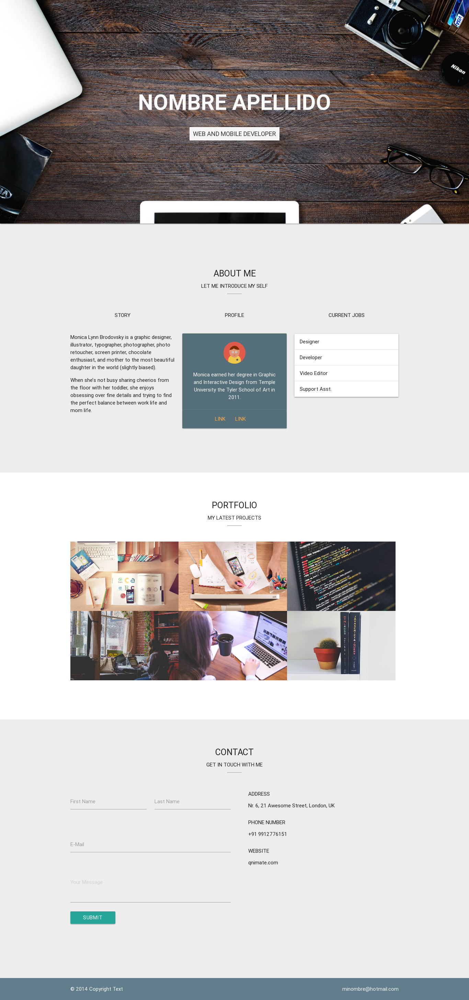
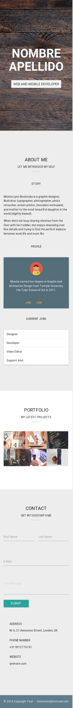

# Portfolio---Materialize

Página Web que muestra el Portafolio de proyectos de Diseño Web.

## Descripción del proyecto

Consta de 5 secciones:

* Header: Nombres y Botón de Inicio.
* About Me: Breve descripción del dueño del portfolio.
* Portfolio: Grupo de proyectos.
* Contact: Para ponerse en contacto con el dueño del Portfolio.
* Footer: Copy Rigth y email del dueño del Portfolio.

## Framework utilizado

Se utilizó el siguiente framework: Materialize.

## Lanzamiento 

Esta es la versión final de la página web del <a href="https://naovillaj.github.io/Portfolio---Materialize/">Portfolio</a>

Versión Desktop: 

Versión Mobile:

## Desarrollado con

Sublime y Atom

* [HTML5] - Para la estructura de la página web
* [CSS3] - Para darle el estilo a la página web
* [JavaScript 1.8.5.] - Para las funcionalidades de la página web

## Autores

* **Mitchell Rodríguez** - **Cindy Mendoza**- **Naomi Villanueva** 
